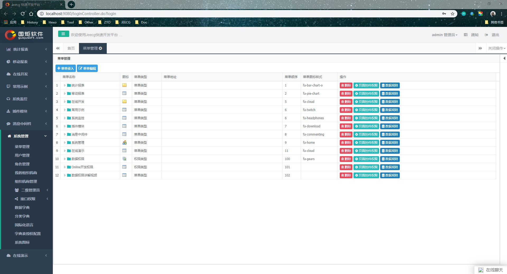
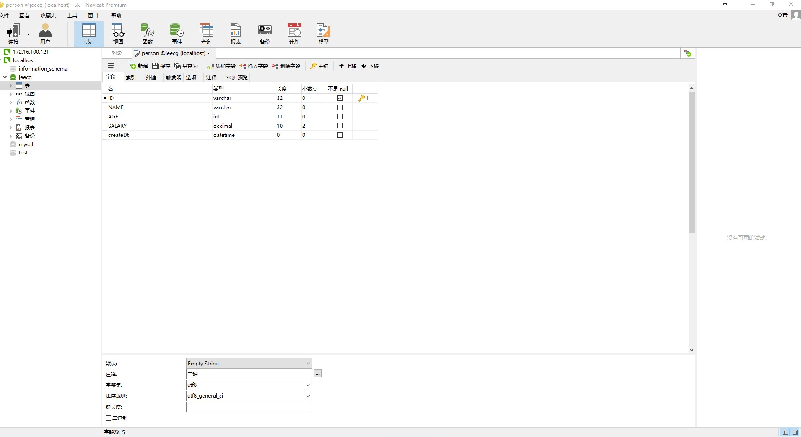
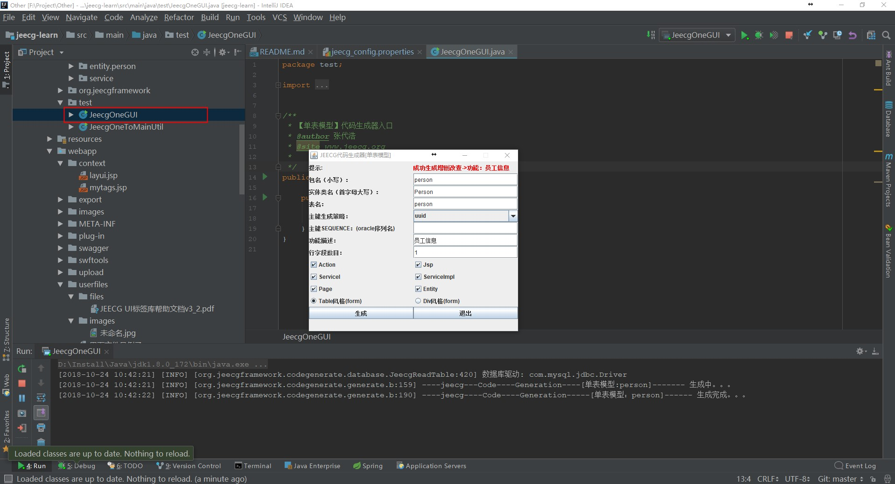

# jeecg-learn

This is a jeecg learn project.

#### JEECG 微云快速开发平台

JEECG微服务架构： jeecg-p3 1.0版

当前最新版本： 3.7.8（发布日期：20180806）

#### 学习了解JEECG框架

##### （1）简介：采用代码生成+手工MERGE半智能开发模式

##### （2）技术：Spring MVC+Hibernate4+UI快速开发库+Spring JDBC+Highcharts图形报表+Jquery+Ehcache

##### （3）开发指南：http://www.jeecg.org/book/jeecg_v3.html#_Toc352870759

##### （4）JEECG框架：https://gitee.com/jeecg/jeecg

##### （5）JEECG 权限控制：http://blog.itpub.net/30066956/viewspace-1868754/

##### （6）JEECG常见问题大全：http://www.jeecg.org/forum.php?mod=viewthread&tid=1830&extra=page%3D1

##### （7）JEECG代码生成器的使用

###### 方式一：GUI工具类
       /src/main/java/test/JeecgOneGUI.java （单表）
       /src/main/java/test/JeecgOneToMainUtil.java（一对表）
       
###### 总结：数据表创建-新增菜单模块节点-角色分配节点权限-根据业务需求进行相关编码       
       
###### 方式二：Online对接代码生成器
   onlinecoding代码生成器菜单：onlinecoding-->表单配置
      
    代码生成器配置文件：
  
    a.数据库配置  src/main/resources/jeecg/jeecg_database.properties（代码生成器和项目的数据库配置是分开的）
  
    b.代码生成器相关配置文件src/main/resources/jeecg/jeecg_config.properties（比如代码生成根路径）

###### 总结：在线创建表单-同步数据库-代码生成-新增菜单模块节点-角色分配节点权限-根据业务需求进行相关编码  
  
###### 示例：
   1）数据表创建 
   
      例： 员工表person
        
   2）代码生成器配置
   
    resources/jeecg目录：
    jeecg_database.properties 数据源配置文件
    jeecg_config.properties 代码生成器参数配置文件
    
   3）代码生成
   
    运行“/src/test/JeecgOneGUI.java”文件，打开代码生成器
    

###### 代码生成器-GUI工具类-操作如图

